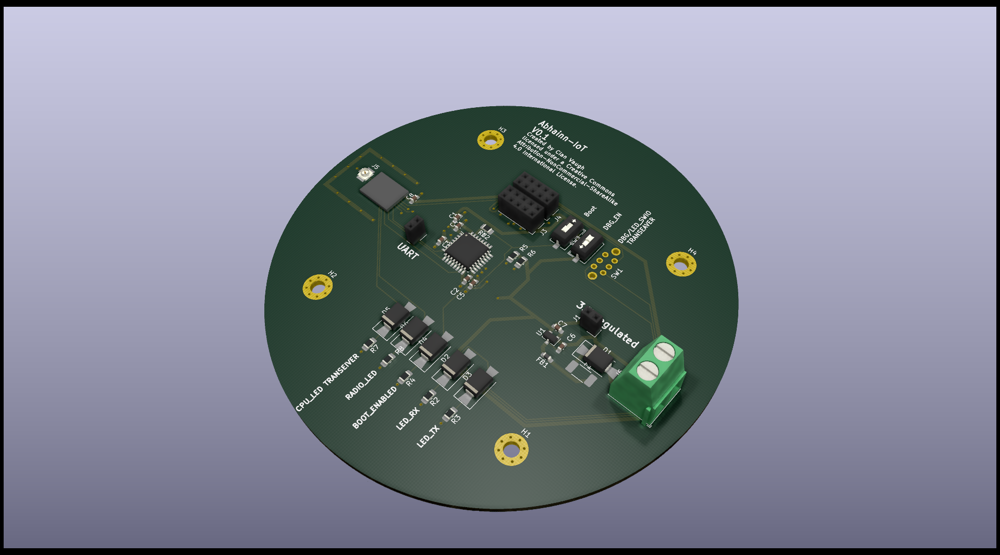
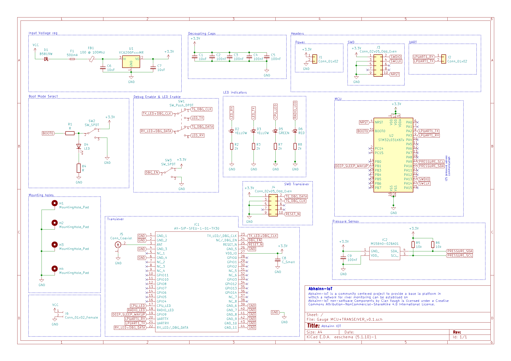

# Abhainn-IoT
Abhainn-IoT is a community centered project to provide a base ia platform in withch a network for river monitoring can be establised on 

* Designed for the Sigfox Network - a low power nttweojk designed spificaly for IoT applications 
chech coverage for your area at <a rel="coverage" href="https://www.sigfox.com/en/coverage">Sigfox websight
</a>.
* Incorprates STM32 Lowpower MCU 

## Current SCH 
Attached below is the most recent Scheamatic. This is a cureenent ongoing projectso some changes will be made as the validation process contunes
A PDF verson is provide in the IMAGES derectory, and all orher Kicad files are provided 

# licenses 
Software components  is licensed under a <a rel="license" href="https://opensource.org/licenses/LGPL-3.0">GNU Lesser General Public License version 3
</a>.

 Abhainn-IoT non-software Components  by <a xmlns:cc="http://creativecommons.org/ns#" href="https://github.com/CianForStuff/Abhainn-IoT" property="cc:attributionName" rel="cc:attributionURL">Cian Vaugh </a> is licensed under a <a rel="license" href="http://creativecommons.org/licenses/by-nc-sa/4.0/">Creative Commons Attribution-NonCommercial-ShareAlike 4.0 International License</a>.
